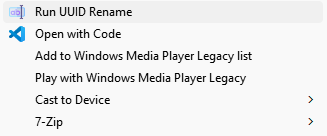

# UUID Rename

This script renames all files in a specified folder to UUIDs. The functionality can be easily accessed from the Windows File Explorer context menu.

## Features

- Rename all files in a folder to UUIDs
- Easy access via right-click context menu in File Explorer




## Prerequisites

- Administrator rights to modify the Windows registry

## Installation

### Step 1: Clone the Repository

Clone this repository to the `C:\run` directory on your system.

```sh
git clone https://github.com/ygohel18/uuid-rename.git C:\run
```


### Step 3: Update Registry

Double-click the `uuid-rename.reg` file to add the custom context menu entry to the Windows registry. This will enable the `Run UUID Rename` option in the right-click context menu of any folder.

## Usage

1. Open File Explorer and navigate to any folder containing files you want to rename.
2. Right-click on the folder.
3. Select **Run UUID Rename** from the context menu.

The script will rename all files in the selected folder to UUIDs.

## How It Works

- The `uuid-rename.bat` batch file is configured to accept the folder path.
- The registry entry `uuid-rename.reg` adds a context menu item that triggers the batch file with the right-clicked folder's path.

## File Structure

```plaintext
uuid-rename/
│
├── uuid-rename.bat
├── uuid-rename.reg
├── rename.ico
├── preview.png
└── README.md
```

## Customization

You can customize the icon and script paths by editing the `uuid-rename.reg` file. Make sure to use the correct absolute paths for your system.

## Troubleshooting

- Ensure the paths in the `uuid-rename.reg` file are correct.
- Run File Explorer as an administrator if you encounter permission issues.

## Contributions

Contributions are welcome! Please open an issue or submit a pull request for any improvements.

## Credits
- [Rename icons created by Freepik - Flaticon](https://www.flaticon.com/free-icons/rename)
- [ChatGPT](https://chatgpt.com/)

## Contact

Feel free to reach out for any queries or support! [me@yashgohel.com](mailto:me@yashgohel.com).

Follow me on social media:
- [Linkedin](https://www.linkedin.com/in/ygohel18/)
- [Twitter @ygohel18](https://twitter.com/ygohel18)
- [Instagram @ygohel18](https://www.instagram.com/ygohel18)
- [Website: yashgohel.com](https://yashgohel.com)